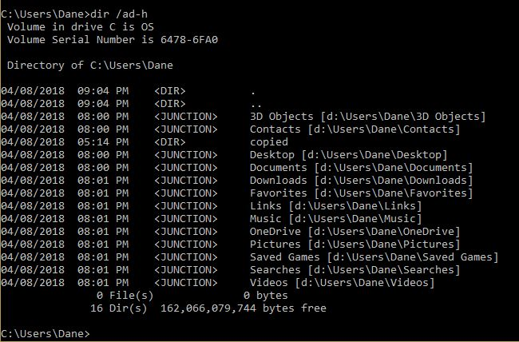
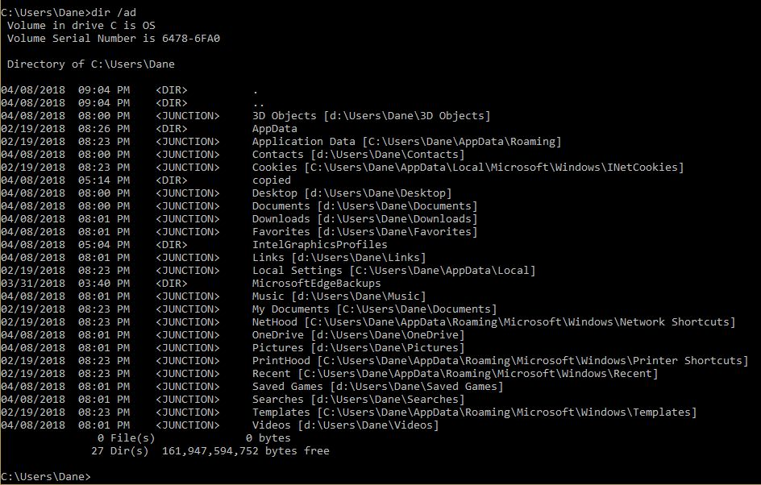

# MoveFolders.bat
MoveFolders.bat is a simple windows batch file created to offload a user folder's standard subfolders to another partition.  This is useful when migrating a windows installation from a large, slow HDD to a small, fast SSD.

Microsoft strongly discourages moving the entire C:\Users folder, and even a C:\Users\{username} folder contains many symlinks (junction points) already.  Trying to move each folder manually using the Folder->Properties->Location tab is frustratingly slow and error-prone at its best.

This approach leaves all that in-tact (C:\Users and C:\Users\{username}), inclding the hidden system folders (AppData, etc), and moves only the non-system folders such as Documents, Downloads, Videos, etc.  (See below image for example.)

This approach performs the following steps:
* capture the current working folder as the "source"
* capture the only input parameter as the "destination"
* confirm the user wants to proceed from "source" to "destination"
* loop across all subfolders that are **_not hidden_** and **_not already a junction point_**
  * use robocopy to _**mirror**_ subfolder to "destination"
  * move copied folder to "copied" subfolder (leaves deletion up to you)
  * creates junction point link with old subfolder name to "destination\subfolder"

# Notes
* I have no idea as of this writing if this method will actually work over the long-haul.  Supposedly moving these folder(s) breaks some sort Windows update(s).  My hope is that the method explored here leaves enough in-tact to keep Windows none the wiser, but offloads the typically most-used user folders to a larger, slower HDD.
* This is provided with The Unlicense.  You can do whatever you want with it, EXCEPT hold me liable for anything that goes wrong.  Good luck!

# Screenshots
Example directory listing after relocating folders:

Example complete directory listing (including existing junction points and hidden folders) after relocating folders:

